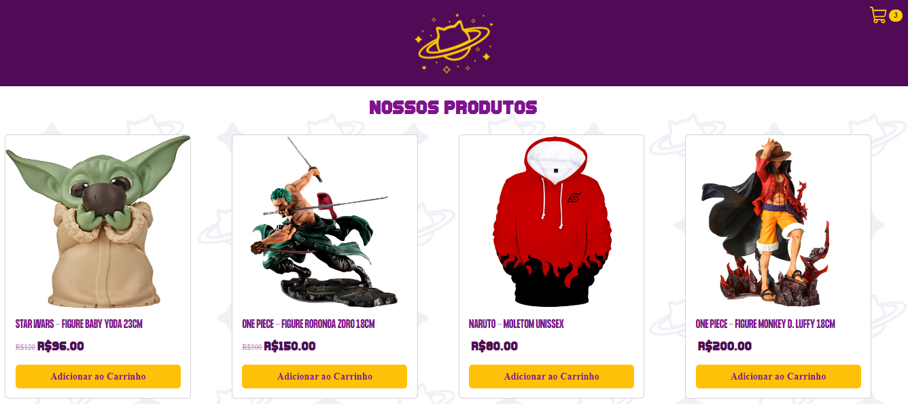

## 
Gatwurno - Carrinho de Compras

Tela de produtos e carrinho de compras. O projeto foi desenvolvido para fins avaliativos do Curso Front-End promovido pelo Instituto NU em parceria com a Descomplica.

 

  

## 🚀 Desenvolvido com:

- REACT
- JavaScript
- REACT BOOTSTRAP
- Git
- Github

## 💻 Projeto:

- [Live](https://suzanefeitosa.github.io/shoppingcart)

 

Coded by Suzane Feitosa ♡ 

 

Importante: Apesar do projeto ter sido desenvolvido tendo como referência a loja Gatwurno que está no mercado, os produtos foram selecionados apenas como objeto de estudo. O catálogo disponível da loja, deve ser consultado diretamente no instagram oficial do e-commerce @gatwurno.
